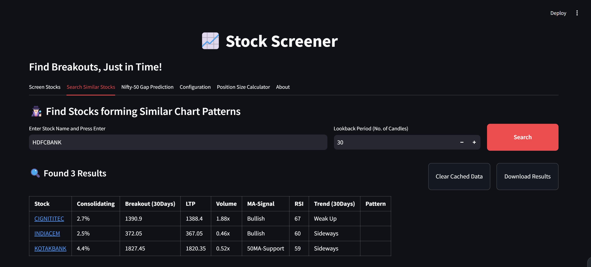
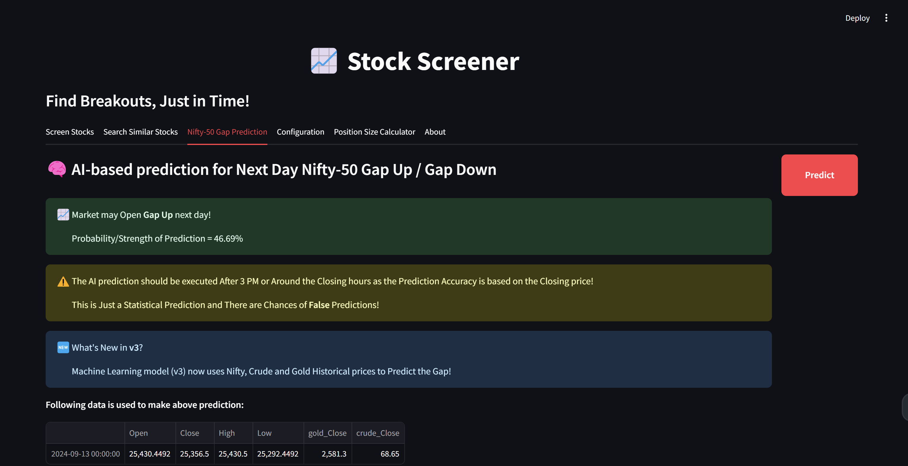
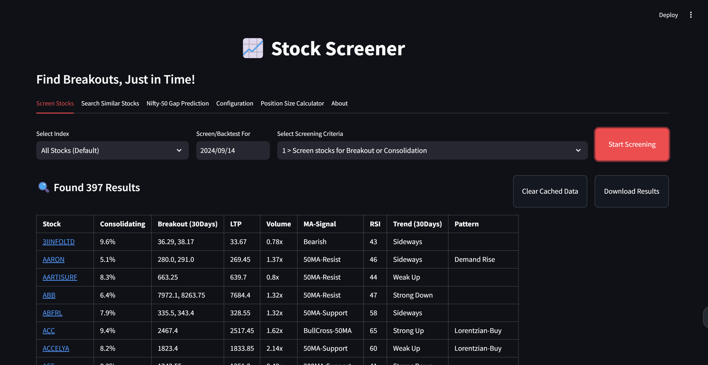
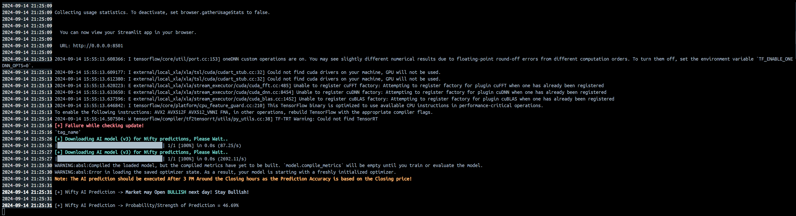

## What is Stock Screener?

### A Python-based stock screener for NSE, India.

**Stocker Screener** is an advanced stock screener to find potential breakout stocks from NSE and tell its possible breakout values. It also helps to find the stocks that are consolidating and may breakout, or the particular chart patterns that you're looking for specifically to make your decisions.
Stock Screener is totally customizable and it can screen stocks with the settings that you have provided.

## How to use? (GUI Based)
1. Download and Install [Docker Desktop](https://www.docker.com/products/docker-desktop/) with default settings
2. If you are using Windows, update WSL (Windows subsystem for linux) by running `wsl --update` command in the command prompt
3. Restart your computer after installation
4. Open Docker Desktop and keep it as it is
5. Open Command Prompt (Windows) or Terminal (Mac/Linux) and run command `docker push vishal17/stockscreener:latest`
6. Once installed, always start Stock Screener by running this command:
    ```
    docker run -p 8501:8501 docker push vishal17/stockscreener:latest

    OR

    docker run -it --entrypoint /bin/bash vishal17/stockscreener:latest -c "run_stockscreener.sh --cli"
    ```

## Screenshots  






## Understanding the Result Table:

The Result table contains a lot of different parameters which can be pretty overwhelming to the new users, so here's the description and significance of each parameter.

| Sr | Parameter | Description | Example |
|:---:|:---:|:---|:---|
|1|**Stock**|This is a NSE scrip symbol. If your OS/Terminal supports unicode, You can directly open **[TradingView](https://in.tradingview.com/)** charts by pressing `Ctrl+Click` on the stock name.|[TATAMOTORS](https://in.tradingview.com/chart?symbol=NSE%3ATATAMOTORS)|
|2|**Consolidating**|It gives the price range in which stock is trading since last `N` days. `N` is configurable and can be modified by executing `Edit User Configuration` option.|If stock is trading between price 100-120 in last 30 days, Output will be `Range = 20.0 %`|
|3|**Breakout (N Days)**|This is pure magic! The `BO` is Breakout level in last N days while `R` is the next resistance level if available. An investor should consider both BO & R level to decide entry/exits in their trades.|`B:302, R:313`(Breakout level is 100 & Next resistance is 102)|
|4|**LTP**|LTP is the Last Traded Price of an asset traded on NSE.|`298.7` (Stock is trading at this price)|
|5|**Volume**|Volume shows the relative volume of the recent candle with respect to 20 period MA of Volume. It could be `Unknown` for newly listed stocks.|if 20MA(Volume) is 1M and todays Volume is 2.8M, then `Volume = 2.8x`|
|6|**MA-Signal**|It describes the price trend of an asset by analyzing various 50-200 MA/EMA crossover strategies.|`200MA-Support`,`BullCross-50MA` etc|
|7|**RSI**|For the momentum traders, it describes 14-period RSI for quick decision-making about their trading plans|`0 to 100`|
|8|**Trend**|By using advanced algorithms, the average trendlines are computed for `N` days and their strength is displayed depending on the steepness of the trendlines. (This does NOT show any trendline on a chart, it is calculated internally)|`Strong Up`, `Weak Down` etc.|
|9|**Pattern**|If the chart or the candle itself forming any important pattern in the recent timeframe or as per the selected screening option, various important patterns will be indicated here.|`Momentum Gainer`, `Inside Bar (N)`,`Bullish Engulfing` etc.|

## Hack it your way:
Feel free to Edit the parameters in the `Stock Screener.ini` file which will be generated by the application.
```
[config]
period = 300d
daystolookback = 30
duration = 1d
minprice = 30
maxprice = 10000
volumeratio = 2
consolidationpercentage = 10
shuffle = y
cachestockdata = y
onlystagetwostocks = y
useema = n
```
Try to tweak these parameters as per your trading styles. For example, If you're comfortable with weekly charts, make `duration=5d` and so on.


## Contributing:
* Please feel free to report bugs by creating an issue here: [Issues](https://github.com/vishalsingh17/StockScreener/issues)
* Please feel free to suggest improvements here: [Wiki](https://github.com/vishalsingh17/StockScreener/wiki)

## Disclaimer:
* DO NOT use the result provided by the software 'solely' to make your trading decisions.
* Always backtest and analyze the stocks manually before you trade.
* The Author and the software will not be held liable for your losses.
